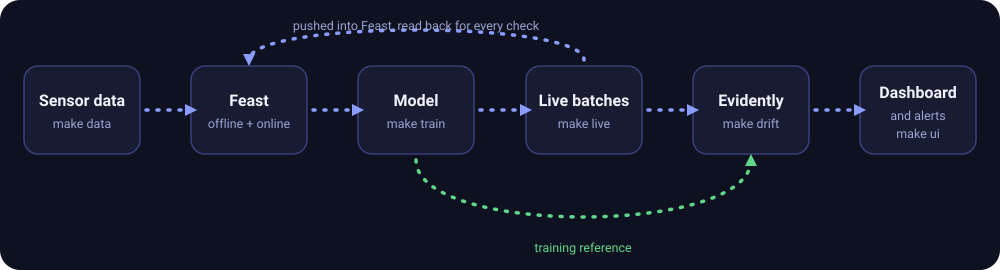
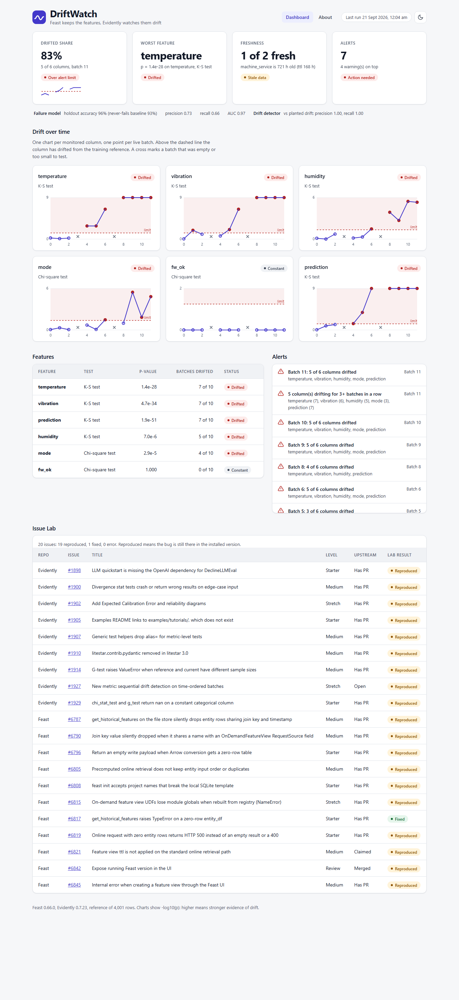
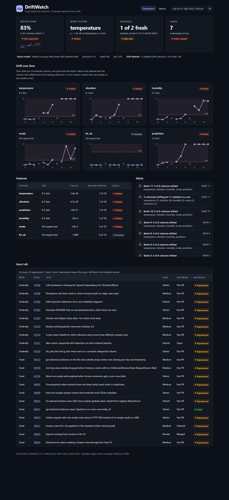
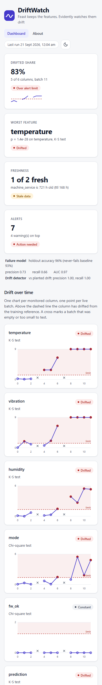

<p align="center">
  
</p>

<p align="center">
  <a href="https://github.com/piscongentine/driftwatch/actions/workflows/ci.yml"></a>
  <a href="LICENSE"></a>
  <a href="requirements.txt"></a>
</p>

<!-- The CI badge assumes the repository lives at github.com/piscongentine/driftwatch. Change the slug if it does not. -->

# DriftWatch

**A small, open-source loop from feature store to drift alert: Feast stores sensor features, a model learns from them, live batches drift, Evidently notices, and a dashboard shows it.**
It runs on a laptop, needs no cloud account and no paid key, and every file is short enough to read in an evening.
See the [About page](ABOUT.md) for what it can do, why it exists, and whose it is (**PiscongentinexMan**).
**New here?** Follow the [User manual](#user-manual-from-a-blank-machine-to-a-working-dashboard): it goes step by step from an empty machine to a working dashboard.

## What is DriftWatch, and why does it exist?

A **feature store** keeps the numbers a model uses (here: the temperature, vibration and humidity of machines) in one place, so the model sees the same values
when it trains and when it is used. **Drift monitoring** answers a quieter question: is the data arriving today still like the data the model learned from?
If sensors wear out, the inputs move, and the model's answers get worse without any error message.

DriftWatch is the whole loop in miniature. [Feast](https://github.com/feast-dev/feast) stores the features. A small model trains on history pulled from Feast.
A live script pushes new batches, some of which slowly drift. [Evidently](https://github.com/evidentlyai/evidently) compares each batch with the training reference,
and a static dashboard plus alerts show what changed. Feast now ships its own feature monitoring, and we do not rebuild it: the value here is the join, and the edge cases that show up when you actually wire the two together.

It also carries an **Issue Lab**: one tiny reproduction for each of 20 real upstream bugs we hit, so a student club can turn them into reviews and pull requests (the **PR sprint**).

## How it works

<p align="center"></p>

## Demo

The four steps of the loop, typed into a real terminal and recorded (about 36 seconds, long waits shortened). Every line is real output:

<p align="center"></p>

The dashboard that reads those results:

<p align="center"></p>

<table>
  <tr>
    <td width="66%"></td>
    <td width="34%"></td>
  </tr>
</table>

The terminal below is an animated SVG built from the same kind of output (it moves on GitHub, and its text is selectable):

<p align="center"></p>

The dashboard also has an [About page](web/about.html) and a light and dark theme: add `?theme=dark` to the address to force one.

**How the GIF was made, and one deviation.** It is not a VHS recording. [`docs/demo.tape`](docs/demo.tape) is a [VHS](https://github.com/charmbracelet/vhs) script for it, and `vhs validate` accepts it,
but on the machine this was built on (Docker Desktop for Windows) VHS ran without writing any file, even from its own official image, so it could not be used there. The GIF was recorded with tools that worked:
[`docs/demo.exp`](docs/demo.exp) types the commands into a real bash session, [`docs/record.sh`](docs/record.sh) records that session with [asciinema](https://asciinema.org) into [`docs/demo.cast`](docs/demo.cast),
and [agg](https://github.com/asciinema/agg) turns the cast into `docs/assets/demo.gif`. Replay the recording in your own terminal with `asciinema play docs/demo.cast`.
If VHS works for you, `vhs docs/demo.tape` writes the same kind of GIF. The terminal in the GIF is Debian 13 with Python 3.13.5, Feast 0.66.0 and Evidently 0.7.23; paths such as `/driftwatch/out` are where the repository was mounted.

## Quickstart

Python 3.10 or newer. Then:

```bash
python -m venv .venv && source .venv/bin/activate     # Windows: .venv\Scripts\activate
make setup && make data && make train && make live && make drift && make ui
```

What you should see (numbers come from the seeded data; times depend on when you run):

```text
$ make data
history : 4001 rows, 40 machines x 100 hours, plus 1 duplicate reading
service : 40 rows, inspection 30 days old
plan    : 12 live batches, sizes [40, 40, 40, 4, 40, 40, 40, 0, 40, 40, 40, 40], drift starts at batch 4

$ make train
features : 4001 rows back from Feast (rows lost: 0)
holdout  : accuracy 0.96 (never-fails baseline 0.932), precision 0.726, recall 0.662, F1 0.692, AUC 0.967

$ make live
batch  0  rows  40  drift 0  pushed  40  online order ok
batch  3  rows   4  drift 0  pushed   4  online order ok
batch  7  rows   0  drift 4  pushed   0  online order ok
batch 11  rows  40  drift 8  pushed  40  online order ok

$ make drift
batch  0  rows  40  share 0.00  gate SUCCESS
batch  3  rows   4  too_small
batch  7  rows   0  empty
batch 11  rows  40  share 0.83  gate FAIL
detection: {'precision': 1.0, 'recall': 1.0, 'false_alarms': [], 'missed': []}
ALERT  Batch 11: 5 of 6 columns drifted  (temperature, vibration, humidity, mode, prediction)
7 alert(s), 4 warning(s)

$ make ui
Dashboard: http://localhost:8000/web/   (Ctrl+C to stop)
```

Every step reads and writes files under `out/`, so you can run any one alone. **No `make`** (plain Windows)? Each recipe in the [Makefile](Makefile) is one line of Python: run it by hand,
or `winget install ezwinports.make`.

**Tested on** (each run used the versions pinned in `requirements.txt`, and covered setup, data, train, live, drift, tests and the Issue Lab):

| System | Python | make | Result |
|---|---|---|---|
| Windows 11 | 3.13 | GNU make 4.4.1, in PowerShell and in Git Bash | Every target passes, 150 tests |
| Windows 11 | 3.14 | commands run by hand | Install, pipeline and all 150 tests pass. Issue Lab: 2 Errors (see Step 1) |
| Debian 13, in Docker | 3.10 | GNU make 4.4.1 | Every step of the manual passes, 150 tests |
| Debian 13, in Docker | 3.11 | GNU make 4.4.1 | Every step of the manual passes, 150 tests |
| Debian 13, in Docker | 3.12 | GNU make 4.4.1 | Every step of the manual passes, 150 tests |
| Debian 13, in Docker | 3.12, offline (`--network none`) | GNU make 4.4.1, from a pre-built virtual environment | Every step passes, 150 tests. Issue Lab: 17 Reproduced, 1 Fixed, 2 Error (`evidently_1905` and `evidently_1898`, which read GitHub) |
| Debian 13, in Docker | 3.13 | GNU make 4.4.1 | Every step of the manual passes, 150 tests |
| Debian 13, in Docker | 3.14 | GNU make 4.4.1 | Every step passes, 150 tests. Issue Lab: 17 Reproduced, 1 Fixed, 2 Error (the same two as Step 1, a different pair from the offline row) |
| macOS | any | any | Not tried |

The numbers were identical on every system, online or offline: holdout AUC 0.967 and drift detector precision and recall 1.0. Two separate full runs on the same machine also gave the same alerts, the same gate decisions and byte-identical files, except for run timestamps and one drift score
that differed in the 16th significant digit (a floating-point rounding difference far too small to change its displayed value or its drift decision). The Issue Lab gave 19 Reproduced and 1 Fixed everywhere except: Python 3.14 (2 Error, see Step 1) and offline runs (2 Error, a different pair, both needing GitHub).
Every `make` target was also checked against the unzipped `driftwatch.zip` itself (Windows and Debian), and every `.github/workflows/*.yml` step ran and passed outside CI, in order, the way GitHub runs them (`actionlint` also passes on both files; no step has actually run on GitHub yet, since the repository is not yet pushed).

Want every step explained, with troubleshooting? See the [User manual](#user-manual-from-a-blank-machine-to-a-working-dashboard).

## User manual: from a blank machine to a working dashboard

The long, step-by-step version. Follow it once from top to bottom. Every step says what to type, what you should see, and what to do if you do not.
In short: **get Python, get the code, make a virtual environment, install, run four steps, open the dashboard.**

### Step 1. What you need

- Windows 10 or 11, macOS, or Linux, and an internet connection for the install.
- **Python 3.10 to 3.13 is the safe range; 3.14 mostly works.** We tested 3.10, 3.11, 3.12, 3.13 and 3.14 (see "Tested on" under Quickstart). On 3.14 the loop, the dashboard and all 150 tests pass, but two Issue Lab checks (feast_6790 and feast_6815) end in Error, because Feast's on-demand views need `dill`, which fails there. Evidently's own package metadata also lists 3.10 to 3.13 only. For the whole Issue Lab, use 3.13 or older.
- About **1 GB of free disk space**. Our virtual environment with every package measured 963 MB.
- A terminal: PowerShell or Windows Terminal on Windows, Terminal on macOS, any shell on Linux.
- Nothing else: no cloud account, no API key, no paid service, no Docker, no Node.
- Optional: `git` (to clone the repository) and `make` (Step 5). Both can be skipped.

### Step 2. Check your Python

```bash
python --version
```

You want `Python 3.10.x` up to `Python 3.13.x`. If the command is not found, or the version is wrong:

- **Windows:** `py -0` lists every Python you have, and `py -3.13 --version` checks one. Install Python from python.org and tick "Add python.exe to PATH".
- **macOS and Linux:** try `python3 --version`. Wherever this manual says `python`, use `python3`, and put `PY=python3` after `make` (for example `make PY=python3 data`).

### Step 3. Get the code

Either:

- **From the zip:** unzip `driftwatch.zip`. You get a folder called `driftwatch`. It already contains a sample `out/` folder, so the dashboard has something to show before you run anything (see Step 8).
- **From git**, once the repository is published: `git clone <the repository address> driftwatch`. A fresh clone has no `out/` folder, because it is generated. The dashboard shows a "No results yet" page until you finish Step 7.

Then open a terminal **inside** the folder:

```bash
cd driftwatch
```

Tip: prefer a short path that is not inside a cloud-synced folder (OneDrive, Dropbox). It works there, but syncing hundreds of small files can slow things down.

### Step 4. Make a virtual environment

A virtual environment is a private folder of Python packages, so DriftWatch does not touch the rest of your computer. Make it once; activate it every time you open a new terminal.

macOS and Linux:

```bash
python3 -m venv .venv
source .venv/bin/activate
```

Windows PowerShell:

```powershell
py -3.13 -m venv .venv
.venv\Scripts\Activate.ps1
```

If PowerShell says running scripts is disabled, allow it for this window only, then activate again: `Set-ExecutionPolicy -Scope Process -ExecutionPolicy Bypass`.
Windows Command Prompt: `.venv\Scripts\activate.bat`. Windows Git Bash: `source .venv/Scripts/activate`.

You should see `(.venv)` at the start of your prompt. Next time, only the activate line is needed.

### Step 5. Install make (recommended, not required)

`make` lets you type `make data` instead of a longer Python command. Check whether you already have it: `make --version`.

| System | How to get make |
|---|---|
| macOS | `xcode-select --install` (command line tools), or `brew install make` |
| Linux (Debian, Ubuntu) | `sudo apt install make` |
| Windows | `winget install ezwinports.make` installs GNU make 4.4.1 for your user, with no admin rights. Then open a **new** terminal: the installer only changes the PATH of terminals opened afterwards. Or use WSL |

Tested: we installed make on Windows 11 exactly this way and ran every target in this manual with it, both in PowerShell and in Git Bash. On Debian Linux we installed it with `apt` and every step passed too. macOS has not been tried. Every make command has a plain Python equivalent in Step 13, so you can skip make entirely.
To remove it later on Windows: `winget uninstall ezwinports.make`.

### Step 6. Install the packages

```bash
make setup
```

This runs `python -m pip install -r requirements.txt`: feast, evidently, pandas, scikit-learn and pytest, plus what they depend on. It usually takes a few minutes. Then check that it worked:

```bash
python -c "import feast, evidently; print('feast', feast.__version__, '| evidently', evidently.__version__)"
```

Expected: `feast 0.66.0 | evidently 0.7.23`. These two versions are pinned on purpose (see `requirements.txt`).

### Step 7. Run the loop, one step at a time

The order matters: **data, then train, then live, then drift.** Each step reads the files the one before it wrote. The first run of a step can take longer while Python loads Feast and Evidently; after that each step takes a few seconds.

**7a. Build the data.**

```bash
make data
```

Creates the synthetic fleet (40 machines, a reading every hour for 100 hours, with the edge cases in on purpose) and the plan for the live run. You should see:

```text
history : 4001 rows, 40 machines x 100 hours, plus 1 duplicate reading
service : 40 rows, inspection 30 days old
plan    : 12 live batches, sizes [40, 40, 40, 4, 40, 40, 40, 0, 40, 40, 40, 40], drift starts at batch 4
```

**7b. Train the model.**

```bash
make train
```

Feast hands over the history, a small model learns to predict machine failure, and the newest 25 percent of history scores it. You should see `rows lost: 0` and a `holdout` line with accuracy, precision, recall, F1 and AUC. The exact numbers can differ a little between library versions.

**7c. Push the live batches.**

```bash
make live
```

Twelve batches arrive one after another. From batch 4 the sensors drift, batch 3 is tiny and batch 7 is empty. Every line should end in `online order ok`. If you see `BROKEN`, the online store returned rows in a different order than asked for (see feast #6805 in the Issue Lab).

**7d. Check for drift and raise alerts.**

```bash
make drift
```

Each batch is read back from Feast and compared with the training data. You should see each batch's drifted share, `empty` and `too_small` for the two odd batches, a `detection:` line, and a list of alerts and warnings. Healthy batches (0 to 3) stay quiet; from batch 4 the share climbs.

**Shortcuts and re-runs.** `make all` runs 7a to 7d in a row. Re-running `make live` is safe: it removes the previous live rows first. **Whenever you re-run `make data`, run train, live and drift again**, because `data` rewrites the timeline. To start over completely: `make clean` (deletes the `out/` folder), then `make all`.

### Step 8. Open the dashboard

```bash
make ui
```

Then open **http://localhost:8000/web/** in your browser. Stop the server with Ctrl+C. To use another port: `make ui PORT=8081`. The server only listens on your own computer (127.0.0.1), so nobody else on your network can reach it.
Do not open `web/index.html` by double-clicking it: browsers block a page opened from disk from reading the JSON files.

If you see **No results yet**, Step 7 has not been run in this folder. If you see **Could not read out/summary.json**, use `make ui` as above.

### Step 9. Read the dashboard

- **Header:** the time of the last run, a link to the About page, and a light and dark button. Dark also follows your system setting; add `?theme=dark` or `?theme=light` to the address to force one.
- **Four cards:** the drifted share of the latest tested batch (with a tiny trend line), the worst feature, how fresh the feature views are, and the number of alerts.
- **The strip under the cards:** how well the failure model did on its holdout, next to the "never fails" baseline, and how well the drift detector did against the drift we planted.
- **Drift over time:** one chart per monitored column, one point per batch. The plotted number is minus log10 of the p-value, so **higher means stronger evidence of drift**. Above the dashed red limit the column has drifted. A cross marks a batch that was empty or too small to test.
- **Features:** the latest p-value per column, how many batches drifted, and a status. `fw_ok` is marked Constant: it never changes, on purpose.
- **Alerts:** newest first. An alert needs action; a warning is something to look at (an untested batch, stale data).
- **Issue Lab:** the results of Step 10, once you have run it.

**Why does it say "Stale data"?** By design `machine_service` holds an inspection value 30 days old with a 7-day time to live. Also, if you run `make drift` more than 6 hours after `make data`, the live features count as stale too. Re-run `make data train live drift` to refresh the timeline.

### Step 10. Run the Issue Lab

```bash
make issues
```

It runs 20 tiny programs, four at a time, one per upstream bug, and prints a table. It takes about 20 seconds. Two of them (evidently 1905 and 1898) read files from GitHub, so they end in **Error** without internet: that is expected. Reload the dashboard to see the table there. How to read it is in [issues/README.md](issues/README.md).

### Step 11. Run the tests

```bash
make test
```

150 tests at the time of writing, about 25 seconds (longer the first time, while Python compiles its caches). They run the whole loop for real in a temporary copy, so your `out/` folder is not touched. Expect `150 passed`.

### Step 12. Make it yours

Every setting is a constant in `config.py`. Change a number, then re-run the steps that depend on it:

| You change | Then run |
|---|---|
| `SEED`, `N_MACHINES`, `HISTORY_HOURS`, `N_BATCHES`, `BATCH_SIZE`, `EMPTY_BATCH`, `TINY_BATCH`, `TINY_SIZE`, `STALE_DAYS`, `DRIFT_START`, `DRIFT_STEP`, `DRIFT_WEIGHTS` | `make all` |
| `VAL_SIZE`, `TEST_SIZE` | `make train drift` |
| `TTL_STATS_HOURS`, `TTL_SERVICE_DAYS` | `make live drift` |
| `NUM_TEST`, `CAT_TEST`, `DRIFT_P`, `MIN_ROWS`, `SHARE_WARN`, `SHARE_ALERT` | `make drift` |
| `STREAK_ALERT` | `make alerts` |

When in doubt, `make all`. To add a new monitored column, see [CONTRIBUTING.md](CONTRIBUTING.md).
To use **your own data** instead of the synthetic fleet, replace the files `make data` writes (`history.parquet`, `labels.parquet`, `service.parquet`) with files that have the same columns, and replace the batch generator in `src/live.py`. That path is not built for you yet: a streaming source is on the roadmap.

### Step 13. No make? Do this instead

Run these from the `driftwatch` folder. Use `python3` or `py -3.13` in place of `python` if that is what works on your machine.

| Instead of | Type |
|---|---|
| `make setup` | `python -m pip install -r requirements.txt` |
| `make data` | `python src/make_data.py` |
| `make train` | `python src/train.py` |
| `make live` | `python src/live.py` |
| `make drift` | `python src/check_drift.py`, then `python src/alerts.py` |
| `make alerts` | `python src/alerts.py` |
| `make ui` | `python -m http.server 8000 --bind 127.0.0.1` |
| `make issues` | `python issues/check_all.py` |
| `make test` | `python -m pytest -q` |
| `make clean` | `python -c "import shutil; shutil.rmtree('out', ignore_errors=True)"` |

### Step 14. When something goes wrong

| What you see | What to do |
|---|---|
| `make` is not recognized, or command not found | Install make (Step 5), or use the table in Step 13. Right after installing it on Windows, open a **new** terminal |
| `python: command not found` inside make | `make PY=python3 data` (on Windows: `make PY="py -3.13" data`) |
| `No module named feast` (or evidently, pandas, ...) | The virtual environment is not active, or Step 6 did not finish: activate it (Step 4) and run `make setup` again |
| PowerShell: "running scripts is disabled" | `Set-ExecutionPolicy -Scope Process -ExecutionPolicy Bypass`, then activate again |
| `FileNotFoundError` mentioning `out` | You skipped a step. Run them in order: data, train, live, drift |
| The dashboard says "No results yet" | Run Step 7 in this folder |
| The dashboard says "Could not read out/summary.json" | Use `make ui`; do not open the HTML file straight from disk |
| "Address already in use" on `make ui` | Another program uses port 8000: `make ui PORT=8081` |
| The dashboard shows old numbers | Reload the page (Ctrl+F5) after re-running a step |
| `make issues` shows Error for evidently_1905 or 1898 | You are offline: those two read files from GitHub |
| Windows shows a `UnicodeEncodeError` | Type `$env:PYTHONIOENCODING='utf-8'` (PowerShell) or `set PYTHONIOENCODING=utf-8` (cmd), then run again |
| Anything strange after many experiments | `make clean`, then `make all` |
| `make issues` shows Error for feast_6790 and feast_6815 | You are on Python 3.14: Feast's on-demand views use `dill`, which does not work there. Use Python 3.13 or older for the full Issue Lab (the rest of DriftWatch works on 3.14) |

Still stuck? Open an issue with the command you ran, your operating system, the output of `python --version`, and the last lines of the output.

### Step 15. Update or remove

- **Try newer Feast or Evidently:** `python -m pip install -U feast evidently`, then `make issues` and `make test`. Some Issue Lab rows may flip to Fixed: that is the point. Then follow [issues/README.md](issues/README.md).
- **Leave:** close the terminal, or type `deactivate`.
- **Remove it all:** delete the `driftwatch` folder (the packages live in `.venv` inside it; pip may keep a download cache elsewhere).

## How to use it (command reference)

| Command | Reads | Writes | What it does |
|---|---|---|---|
| `make data` | `config.py` | `out/data/history.parquet`, `service.parquet`, `labels.parquet`, `plan.json` | Builds the synthetic fleet, with the edge cases left in on purpose, and the plan for the live run |
| `make train` | `labels.parquet`, Feast | `out/model.pkl`, `train_report.json`, `data/reference.parquet` | Pulls history through Feast, trains a logistic regression, scores it on the newest 25%, saves the reference |
| `make live` | `plan.json`, `service.parquet`, Feast | Feast stores, `data/batches/`, `live_log.json`, `freshness.json` | Creates each batch (some drifted, one empty, one tiny) and pushes it into Feast. Safe to repeat |
| `make drift` | reference, batches, model, Feast | `out/summary.json`, `alerts.json` | Reads each batch back from Feast, tests it with Evidently, then raises alerts |
| `make ui` | `web/`, `out/*.json` | nothing | Serves the repo at `http://localhost:8000/web/` (local only) |
| `make test` | everything | nothing | Runs the tests (about 25 s) |
| `make issues` | `issues/`, `sprint/ISSUES.md` | `out/issues.json` | Runs the Issue Lab, prints Reproduced, Fixed or Error |

The edge cases are on purpose: a constant `fw_ok` flag, live batches far smaller than the reference, one empty batch, two readings with the same machine and timestamp,
and a feature with an old timestamp. Each is explained in `issues/<name>/NOTES.md`.

## Configuration

Every setting is a plain constant in [`config.py`](config.py). Change a number and re-run the step.

| Constant | Default | Meaning |
|---|---|---|
| `ROOT`, `OUT`, `DATA`, `REPO` | repo, `out/`, `out/data/`, `feature_repo/` | Base folders. Scripts write only under `out/` |
| `HISTORY`, `SERVICE`, `LABELS` | `out/data/*.parquet` | Feast offline sources (sensor readings, old inspection values) and the label table |
| `PLAN`, `BATCHES`, `REFERENCE` | `plan.json`, `batches/`, `reference.parquet` | The live schedule, one file per batch, and the training reference |
| `MODEL`, `TRAIN_REPORT`, `LIVE_LOG`, `FRESHNESS` | under `out/` | Model file and run reports |
| `SUMMARY`, `ALERTS`, `ISSUES_STATUS` | `out/*.json` | The three files the dashboard reads |
| `SEED` | 7 | Same seed, same numbers |
| `N_MACHINES` | 40 | Machines in the fleet |
| `HISTORY_HOURS` | 100 | Hourly readings per machine in the training history |
| `N_BATCHES` | 12 | Live batches, one per hour |
| `BATCH_SIZE` | 40 | Rows in a normal batch (one reading per machine) |
| `EMPTY_BATCH`, `TINY_BATCH`, `TINY_SIZE` | 7, 3, 4 | Which batch is empty, which is tiny, and how tiny |
| `STALE_DAYS` | 30 | Age of the inspection feature, on purpose |
| `DRIFT_START`, `DRIFT_STEP` | 4, 0.35 | First drifted batch, and the shift added per batch (in standard deviations) |
| `DRIFT_WEIGHTS` | temperature 1.0, vibration 0.8, humidity 0.4 | How strongly each sensor drifts |
| `NUMERIC`, `MODES`, `CATEGORICAL` | sensors, idle/normal/high, `mode` and `fw_ok` | Column groups |
| `MONITORED`, `FEATURE_COLS`, `LABEL_COLS` | derived | Columns Evidently checks, and the column order Feast writes |
| `PUSH_SOURCE`, `STATS_VIEW`, `SERVICE_VIEW`, `FEATURES` | Feast names | Push source, the two feature views, and the feature list |
| `TTL_STATS_HOURS`, `TTL_SERVICE_DAYS` | 6, 7 | Time to live of each feature view |
| `VAL_SIZE`, `TEST_SIZE` | 0.15, 0.25 | Time-ordered split: newest 25% scores the model, the 15% before it picks the threshold |
| `NUM_TEST`, `CAT_TEST` | `ks`, `chisquare` | Drift tests for numeric and categorical columns |
| `DRIFT_P` | 0.05 | A p-value below this means drift |
| `MIN_ROWS` | 5 | Smaller batches are not tested |
| `SHARE_WARN`, `SHARE_ALERT` | 0.20, 0.40 | Share of columns drifted in a batch that warns, and that alerts |
| `STREAK_ALERT` | 3 | A column drifting this many tested batches in a row |
| `ISSUES_DIR`, `TRACKER`, `ISSUE_WORKERS`, `ISSUE_TIMEOUT` | `issues/`, `sprint/ISSUES.md`, 4, 240 | Issue Lab folder, tracker file, parallel repros, seconds before an Error |

## Project layout

```text
driftwatch/
  README.md, ABOUT.md, CONTRIBUTING.md, LICENSE   the front door, the story, how to help, Apache-2.0
  Makefile, requirements.txt, config.py            every step, the five libraries, every setting
  feature_repo/    Feast: feature_store.yaml, entities.py, views.py
  src/             make_data, train, live, check_drift, alerts, workarounds (plus store.py and model.py, shared helpers)
  web/             the static dashboard: index.html, about.html, style.css, tokens.css and small scripts, no build step
  issues/          the Issue Lab: 20 folders (repro.py + NOTES.md), lab.py, check_all.py, README.md
  sprint/          SPRINT.md (rules, schedule), ISSUES.md (the tracker), count.py (live numbers)
  docs/            assets/ (animated SVGs, screenshots, demo.gif) and the recording: demo.tape, demo.exp, record.sh, demo.cast
  tests/           unit tests, an end-to-end pipeline test, style and accessibility checks
  .github/         CI, the drift check for pull requests, issue and PR templates
```

Every file under `src/` starts with a header saying what it reads and writes. `src/workarounds.py` is the one place for temporary fixes of upstream bugs, each tagged with its issue number.

## Issue Lab

`make issues` runs one tiny program per upstream bug and prints a table:

```text
folder           upstream  lab result   secs  title
evidently_1929   Has PR    Reproduced    3.3  chi_stat_test and g_test return nan on a constant categorical column
feast_6817       Has PR    Fixed         3.5  get_historical_features raises TypeError on a zero-row entity_df
...
19 Reproduced, 1 Fixed, 0 Error
```

**Reproduced** means the bug is still there in the installed versions. **Fixed** means it is not seen any more (fixed upstream, or never in this release: each `NOTES.md` says which we know).
The dashboard shows the same table. Details, and how to add a folder, are in [issues/README.md](issues/README.md). When a row flips to Fixed, delete its workaround and flip the tracker.

### What each Lab result means, and how it can be fixed

Every row below answers the same questions about one Lab result. **Reason** is why the code behaves this way. **What it means** is the plain-words version.
**Trouble it can cause** is what can go wrong for someone who hits it; "Seen here" marks trouble we saw ourselves, in the Lab's reproduction or in DriftWatch's own run, and the rest is what can follow.
**How it can be solved** gives the upstream fix (a pull request, where one exists) and what DriftWatch does meanwhile. The reasons come from each folder's `NOTES.md`; where a cell says "per the issue", we did not check that part ourselves.
Pull request states were last checked on 20 Sep 2026 and change quickly. **Reproduced** means confirmed here, on the installed versions, not confirmed by the upstream maintainers.

**Evidently 0.7.23**

| Issue | Reason | What it means | Trouble it can cause | How it can be solved |
|---|---|---|---|---|
| [#1929](https://github.com/evidentlyai/evidently/issues/1929) | One category on both sides leaves nothing to compare; `chi_stat_test` and `g_test` return `nan` (`z_stat_test` correctly returns 1.0). | The drift score of a constant column is not a number. | Seen here: `nan` made `summary.json` invalid JSON, so the dashboard could not read it. A constant flag column can break whatever reads the results. | Return p = 1.0 for identical data (PR [#1932](https://github.com/evidentlyai/evidently/pull/1932)). Meanwhile `patch_evidently()` does that. |
| [#1914](https://github.com/evidentlyai/evidently/issues/1914) | `g_test` gives scipy expected counts straight from the reference, and scipy refuses when the two sample sizes differ. `chisquare` rescales them, so it works. | A G-test only works when reference and batch have the same size, which live batches almost never do. | Seen here: the whole report aborted on the first batch (40 rows against 4,001). | Rescale the expected counts like `chisquare` does (PRs [#1913](https://github.com/evidentlyai/evidently/pull/1913) and [#1928](https://github.com/evidentlyai/evidently/pull/1928): compare them). Meanwhile `CAT_TEST = "chisquare"`. |
| [#1900](https://github.com/evidentlyai/evidently/issues/1900) | Nothing guards an empty series: `psi`, `kl_div` and `jensenshannon` raise an opaque `ZeroDivisionError`, and `hellinger` quietly returns `nan`. | An empty batch turns a drift test into a crash, or into a silent `nan`. | Monitoring can stop, or carry on with a bad number, exactly when a sensor goes quiet. Seen here: both behaviours. | Check for empty input and raise a clear `ValueError` (PR [#1924](https://github.com/evidentlyai/evidently/pull/1924); [#1901](https://github.com/evidentlyai/evidently/pull/1901) is the other). Meanwhile batches under `MIN_ROWS` never reach a test. |
| [#1907](https://github.com/evidentlyai/evidently/issues/1907) | `gte()` passes `alias=` to the metric-level test; `gt`, `lt`, `lte`, `eq`, `not_eq`, `is_in` and `not_in` pass it only to the descriptor test. | The name you give a test is ignored by 7 of the 8 helpers. | Seen here: our drift gate came out labelled with Evidently's own name. Alerts and reports show a label nobody chose, which confuses readers. | Pass `alias` through in every helper (PR [#1908](https://github.com/evidentlyai/evidently/pull/1908)). Meanwhile `with_alias()` restores our label. |
| [#1927](https://github.com/evidentlyai/evidently/issues/1927) | A missing feature, not a defect: each batch is compared with the reference on its own, and no metric reads batches in time order. | A slow shift that no single batch shows goes unseen. | Slow drift is noticed late, when one batch finally fails. Nothing breaks, so nothing is seen here. | A CUSUM-style metric as a first version. It is feature work: ask the maintainers first (Evidently's CONTRIBUTING asks for an issue). No PR yet. |
| [#1902](https://github.com/evidentlyai/evidently/issues/1902) | A missing feature: no Expected Calibration Error metric and no reliability diagram (confidence against accuracy, per bin). | You cannot check whether a model's confidence matches how often it is right. | An over-confident model can look fine on accuracy while its probabilities mislead, and thresholds built on them are wrong. Not seen here. | Add the metric and the diagram. PR [#1896](https://github.com/evidentlyai/evidently/pull/1896) adds Brier score and ECE (it is not linked to this issue, and whether it covers the diagram is unverified): read it first. |
| [#1905](https://github.com/evidentlyai/evidently/issues/1905) | `examples/README.md` links `./tutorials/`, a folder that is not on `main` (GitHub answers 404 for it and 200 for `cookbook`). | A documentation error, not a code bug. | A newcomer's click lands on a dead link. | Fix or remove the link (PR [#1906](https://github.com/evidentlyai/evidently/pull/1906)). |
| [#1898](https://github.com/evidentlyai/evidently/issues/1898) | The quickstart installs only `evidently`, then uses `DeclineLLMEval`, which defaults to OpenAI. A fresh install has no `openai` package. The docs live in another repo, `evidentlyai/docs`. | Following the guide word for word does not work. | A new user can fail partway through the quickstart. (We did not run it with a key, so we did not see the exact error.) | Add `openai` to the install line (PR [evidentlyai/docs#2](https://github.com/evidentlyai/docs/pull/2)). Open docs pull requests in that repo. |
| [#1910](https://github.com/evidentlyai/evidently/issues/1910) | `evidently/utils/schema.py` imports from `litestar.contrib.pydantic`, a path litestar 3.0 removed (per the issue). | A future break. Nothing fails today: the installed litestar is 2.24.0, the newest on PyPI when we checked. | Once litestar 3 exists, `evidently ui` should fail on import (per the issue). Not seen: there is nothing to install yet. | Import from `litestar.plugins.pydantic`, there since litestar 2.19.0 (per the issue): PR [#1919](https://github.com/evidentlyai/evidently/pull/1919), draft [#1912](https://github.com/evidentlyai/evidently/pull/1912). |

**Feast 0.66.0**

| Issue | Reason | What it means | Trouble it can cause | How it can be solved |
|---|---|---|---|---|
| [#6787](https://github.com/feast-dev/feast/issues/6787) | On the file (Dask) offline store, entity rows with the same join key and timestamp are collapsed into one. (Per the issue, DuckDB and the SQL stores are not affected.) | Fewer training rows than you asked for, with no error. | Seen here: 3 rows in, 2 out. A model can train on data that quietly lost rows and their labels. | Give each entity row a unique id (PR [#6786](https://github.com/feast-dev/feast/pull/6786)). Meanwhile `pull_features()` merges the answer back, and `make train` prints `rows lost: 0`. |
| [#6817](https://github.com/feast-dev/feast/issues/6817) | Per the issue, on master an empty `entity_df` fails inside `_normalize_timestamp`. On the released 0.66.0 we got an empty frame and do not know why. | Where it fails, an empty request crashes instead of returning an empty result. Lab result **Fixed** means not seen here. | A job that sometimes has zero rows can crash. Not seen on 0.66.0. | Handle the empty case (PR [#6818](https://github.com/feast-dev/feast/pull/6818); untested against master here). Meanwhile `pull_features()` returns an empty frame first. |
| [#6819](https://github.com/feast-dev/feast/issues/6819) | Nothing checks for an empty request: `get_online_features(entity_rows=[])` raises `IndexError`, and the feature server answers HTTP 500 to `{"driver_id": []}` and to `{}`. | Asking for nothing is treated as a server fault, not as an empty answer. | Seen here: all three shapes. A 500 looks like an outage, so monitoring can page someone over an empty request. | Return an empty result (PR [#6820](https://github.com/feast-dev/feast/pull/6820)). Meanwhile `online_rows()` skips the call. |
| [#6796](https://github.com/feast-dev/feast/issues/6796) | `_convert_arrow_fv_to_proto` reads `table.to_batches()[0]`, and a zero-row table has no batches, so it raises `IndexError`. | A private helper crashes on empty input. (The public `store.push()` did not fail in our test.) | An empty batch that reaches the helper can stop a pipeline. Seen here: the helper, called directly. | Return an empty payload early (PR [#6797](https://github.com/feast-dev/feast/pull/6797)). Meanwhile `push_batch()` returns 0 for an empty frame. |
| [#6805](https://github.com/feast-dev/feast/issues/6805) | With `precompute_online=True` the read path de-duplicates and sorts the keys, then fills response rows by position, not by key. | The answers do not line up with the questions. | Seen here: asking for `[1003, 1001, 1003, 1002]` gave `[0.1, 0.2, 0.3, None]`, not `[0.3, 0.1, 0.3, 0.2]`. Silently wrong values: one machine can be scored with another's features. | Map results back to the request rows (PR [#6806](https://github.com/feast-dev/feast/pull/6806)) and test the async path too (untested here). DriftWatch does not use this path. |
| [#6821](https://github.com/feast-dev/feast/issues/6821) | Standard online retrieval does not compare the event timestamp with the view's `ttl` (historical retrieval does). The `OUTSIDE_MAX_AGE` status exists but is unused here. | `ttl` is not enforced online: old values are served as if fresh. | Seen here: a one-hour-old value with a one-minute `ttl` came back `PRESENT`. A model can predict from stale numbers (a dead sensor, a stuck pipeline) with no warning. | Enforce `ttl` online (missing, or `OUTSIDE_MAX_AGE`). No PR yet; it was claimed on 7 Sep, so ask first. Meanwhile `is_stale()` and a stale alert. |
| [#6808](https://github.com/feast-dev/feast/issues/6808) | `feast init` does not check the name against the SQLite online store's rule (no hyphens, because the name becomes part of a table name). | `init` succeeds and leaves a repo that cannot load. | A newcomer's first project fails right after `init`. Seen here: `feast init feast-smoke`, then loading it. | Reject the name in `init`, or let the template cope (PR [#6809](https://github.com/feast-dev/feast/pull/6809)). Meanwhile our project name has no hyphen. |
| [#6790](https://github.com/feast-dev/feast/issues/6790) | A name shared by a join key and an on-demand view's `RequestSource` field is treated as request data only, so the regular view never gets its join key. | Valid input is rejected with a misleading error. | Seen here: `Missing join key values for keys: [...]` although the value was given, while the historical path takes the same input. Not hit by DriftWatch yet (no on-demand views). | Stop treating the shared name as request data only (PR [#6794](https://github.com/feast-dev/feast/pull/6794)). Meanwhile name request fields differently from join keys. |
| [#6845](https://github.com/feast-dev/feast/issues/6845) | The UI's create form posts to `POST /feature_views`, whose handler builds the batch source from the name only, so the registry answers "Could not identify the source type being added" (HTTP 422 here). | Creating a feature view from the UI does not work. | The reporter saw an internal error in the UI. We reproduced the API answer without a browser, so we did not see that message. | Resolve the batch source name against the registry, as the title of PR [#6849](https://github.com/feast-dev/feast/pull/6849) says. It matters only if you add views through `feast ui`. |
| [#6842](https://github.com/feast-dev/feast/issues/6842) | A feature request (show the running version). The fix is merged on master (PR [#6843](https://github.com/feast-dev/feast/pull/6843), 17 Sep), but the installed 0.66.0 has no `/version` route (404). | The fix exists but is not in a release yet, so Reproduced here means "not in your version". | Little: you cannot read the version from a running server or the UI, which slows support. Nothing fails. | Upgrade when a release contains PR #6843, then run `make issues`: this row should flip to Fixed. Meanwhile `summary.json` reads the version itself. |
| [#6815](https://github.com/feast-dev/feast/issues/6815) | Per the issue, Feast rebuilds an on-demand function from its source text alone, so module-level helpers and constants are missing in a process that only has the registry (a feature server). | It works where you defined it and fails where it is served. | Seen here: `NameError: name 'scaled' is not defined` in a second process. A works-on-my-machine bug that shows up at serving time. | A deeper change to Feast's serialization (PR [#6816](https://github.com/feast-dev/feast/pull/6816)). Meanwhile keep on-demand functions self-contained. |

Counting the rows: 19 are **Reproduced** and 1 (#6817) is **Fixed**. On Python 3.14 the two checks that build an on-demand view (#6790 and #6815) end in **Error** instead, because Feast serialises the view with `dill` (0.3.9 here),
which fails on 3.14 with `TypeError: _Pickler._batch_setitems() missing 1 required positional argument: 'obj'`. Use Python 3.13 or older for the full Lab.
The longer story for each row, including what we could not verify, is in its `issues/<folder>/NOTES.md`.

## Contributing

Fork, branch, run `make test`, open a pull request. The full guide (branch names, commit style, review checklist, how to add a test, a drift feature or an Issue Lab folder) is in [CONTRIBUTING.md](CONTRIBUTING.md).
Starter tasks live in [sprint/ISSUES.md](sprint/ISSUES.md), labelled Starter. Code style in short: Python 3.10+, only `feast`, `evidently`, `pandas`, `scikit-learn` and `pytest`, one job per file, about 150 lines at most, a header on every file, no emoji.

## PR Sprint

Four weeks to turn the lab into reviews and pull requests upstream: [sprint/SPRINT.md](sprint/SPRINT.md) has the rules and the schedule. The short version: pick one row, read every comment on the upstream issue,
never start a competing pull request, reproduce first, follow each upstream project's own rules (Evidently uses ruff and mypy; Feast wants signed-off commits and conventional titles), keep pull requests small, be patient.

**The situation on 20 Sep 2026:** 17 of 20 issues already had a pull request, 1 was merged, 1 claimed, 1 open, so weeks 1 and 2 are mostly review and test work.
Live count (`python sprint/count.py`; update this line after each merge):

| Issues tracked | Has PR | Merged | Claimed | Open | Owned by a member | Club pull requests | Upstream PRs listed |
|---|---|---|---|---|---|---|---|
| 20 | 17 | 1 | 1 | 1 | 0 | 0 | 21 |

Security reports are never part of the sprint: report them privately (Feast: its `SECURITY.md`).

## Roadmap

- **Sequential drift:** a CUSUM-style detector for time-ordered batches ([evidently #1927](https://github.com/evidentlyai/evidently/issues/1927)).
- **Calibration panel:** model quality on live batches, with a reliability diagram ([evidently #1902](https://github.com/evidentlyai/evidently/issues/1902)).
- **Streaming source:** replace the replayed plan with a small stream of readings.
- **A VHS recording:** `docs/demo.tape` passes `vhs validate` but has never produced a GIF here (see [Demo](#demo)); try it where VHS runs.
- **A Docker image** for one-command setup.

## Credits and license

Copyright PiscongentinexMan and the DriftWatch contributors. Licensed under the [Apache License 2.0](LICENSE), the same license as both projects below.
Inspired by and built on **[Feast](https://github.com/feast-dev/feast)** (feast-dev) and **[Evidently](https://github.com/evidentlyai/evidently)** (Evidently AI).
DriftWatch is an independent club project: it is not affiliated with, endorsed by, or sponsored by either, and their names belong to their owners. All data here is synthetic.
